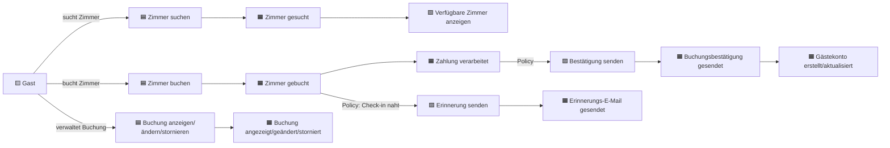
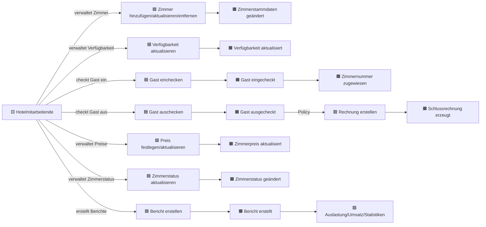
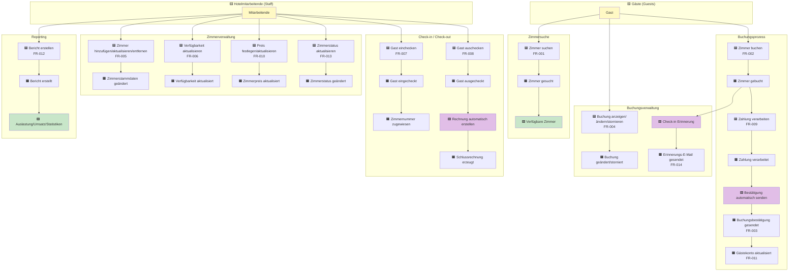

# Event Storming Diagram - Hotelreservierungssystem

## Legende
- 🟦 **Kommandos** (Commands) - Aktionen, die von Benutzern ausgelöst werden
- 🟧 **Domain Events** - Dinge, die im System passieren
- 🟨 **Akteure** (Actors) - Wer löst Kommandos aus
- 🟪 **Policies** - Automatische Reaktionen auf Events
- 🟩 **Read Models** - Ansichten/Abfragen

---

## Buchungs-Flow (Gäste)

---

## Hotelverwaltungs-Flow (Mitarbeitende)

---

## Vollständiges Event Storming Board

---

## Aggregates (Bounded Contexts)

### 1. **Buchung (Reservation)**
- **Events**: Zimmer gebucht, Buchung geändert, Buchung storniert, Zahlung verarbeitet, Bestätigung gesendet
- **Commands**: Zimmer buchen, Buchung ändern, Buchung stornieren
- **Business Rules**:
  - Verfügbarkeit prüfen vor Buchung
  - Zahlung erforderlich für Buchung
  - Stornierungsrichtlinien beachten

### 2. **Zimmer (Room)**
- **Events**: Zimmerstammdaten geändert, Verfügbarkeit aktualisiert, Zimmerpreis aktualisiert, Zimmerstatus geändert
- **Commands**: Zimmer hinzufügen/aktualisieren/entfernen, Verfügbarkeit aktualisieren, Preis festlegen
- **Business Rules**:
  - Zimmertyp und Kapazität definieren
  - Preise saisonabhängig
  - Status: verfügbar, sauber, schmutzig, Wartung, außer Betrieb

### 3. **Aufenthalt (Stay)**
- **Events**: Gast eingecheckt, Zimmernummer zugewiesen, Gast ausgecheckt, Schlussrechnung erzeugt
- **Commands**: Gast einchecken, Gast auschecken
- **Business Rules**:
  - Check-in nur mit gültiger Buchung
  - Zimmernummer bei Check-in zuweisen
  - Rechnung bei Check-out erstellen

### 4. **Gästekonto (Guest Account)**
- **Events**: Gästekonto erstellt/aktualisiert, Buchungshistorie aktualisiert
- **Commands**: Kontodaten aktualisieren, Buchungshistorie abfragen
- **Business Rules**:
  - Kontaktdaten pflegen
  - Buchungshistorie speichern

### 5. **Reporting**
- **Events**: Bericht erstellt
- **Commands**: Bericht erstellen (Auslastung, Umsatz, Buchungsstatistiken)
- **Business Rules**:
  - Historische Daten auswerten
  - Verschiedene Berichtstypen unterstützen

---

## Wichtige Policies (Automatisierung)

1. **🟪 Buchungsbestätigung automatisch senden**
   - **Trigger**: Zimmer gebucht + Zahlung verarbeitet
   - **Aktion**: E-Mail mit Reservierungsdetails senden

2. **🟪 Check-in Erinnerung senden**
   - **Trigger**: Check-in-Datum naht (z.B. 24h vorher)
   - **Aktion**: Erinnerungs-E-Mail an Gast senden

3. **🟪 Schlussrechnung automatisch erstellen**
   - **Trigger**: Gast ausgecheckt
   - **Aktion**: Rechnung generieren und bereitstellen

4. **🟪 Verfügbarkeit aktualisieren**
   - **Trigger**: Zimmer gebucht / Gast eingecheckt / Gast ausgecheckt
   - **Aktion**: Zimmerverfügbarkeit im System aktualisieren

---

## Externe Systeme

- 🟩 **Zahlungssystem** (FR-009): Kreditkartenzahlungen verarbeiten
- 🟩 **E-Mail-System** (FR-003, FR-014): Bestätigungen und Erinnerungen versenden
- 🟩 **Reporting-System** (FR-012): Berichte generieren

---

## Hot Spots / Risiken 🔴

1. **Doppelbuchungen vermeiden**: Gleichzeitige Buchungen desselben Zimmers
2. **Zahlungssicherheit**: PCI-DSS-Konformität für Kreditkartendaten (NFR-004)
3. **Verfügbarkeitskonsistenz**: Synchronisation zwischen Buchungen und Check-ins
4. **Stornierungsfristen**: Rückerstattungslogik und Geschäftsregeln
5. **Gleichzeitige Benutzer**: 50 gleichzeitige Benutzer unterstützen (NFR-003)
6. **Antwortzeiten**: < 1s für Suche, < 2s für Buchung (NFR-001)